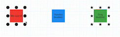

<!--
This README describes the package. If you publish this package to pub.dev,
this README's contents appear on the landing page for your package.

For information about how to write a good package README, see the guide for
[writing package pages](https://dart.dev/guides/libraries/writing-package-pages).

For general information about developing packages, see the Dart guide for
[creating packages](https://dart.dev/guides/libraries/create-library-packages)
and the Flutter guide for
[developing packages and plugins](https://flutter.dev/developing-packages).
-->

A Positioned Widget that can handle repositioning itself based on user input.

## Features

Reposition your widget.

Change the size of your widget.

Customize drag handles.



## Getting started

### 1. Depend on it

Add this to your package's `pubspec.yaml` file:

```yaml
dependencies:
    adjustable_positioned: '^1.0.0'
```


#### 2. Install it

You can install packages from the command line:

```bash
$ pub get
..
```

Alternatively, your editor might support pub. Check the docs for your editor to learn more.

#### 3. Import it

Now in your Dart code, you can use:

```Dart
import 'package:adjustable_positioned/adjustable_positioned.dart';
```

## Usage

```dart

```

## Additional information

https://github.com/jdrotos/adjustable_positioned
